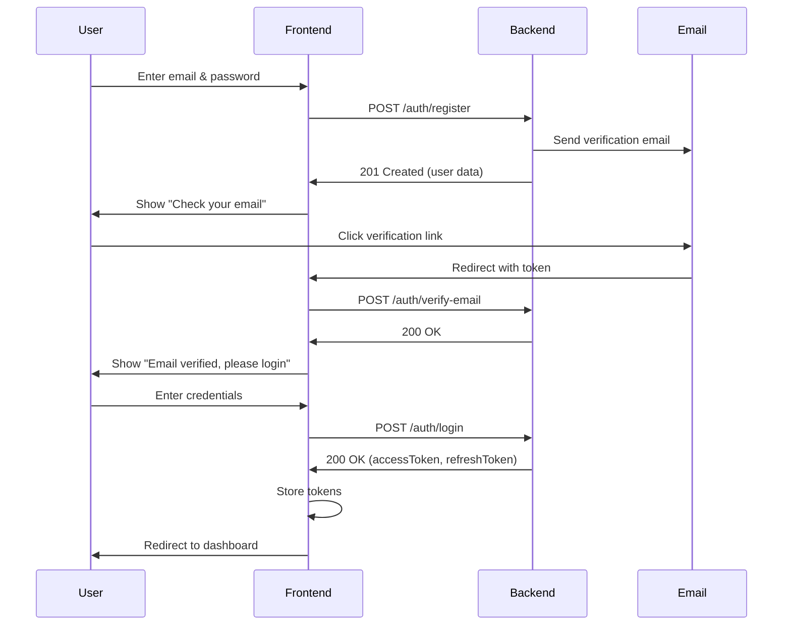
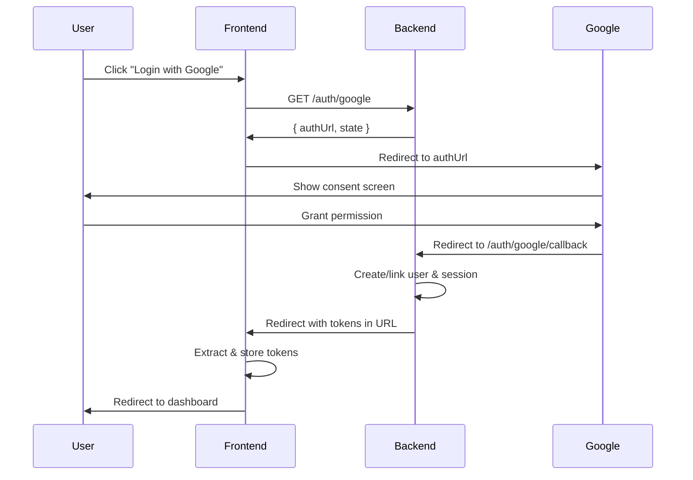

# Authentication API Integration Guide for Frontend

**Version:** 1.0
**Base URL:** `http://localhost:3000/api/v1/auth` (Development)
**Production URL:** `https://your-domain.com/api/v1/auth`

---

## Table of Contents

1. [Quick Start](#quick-start)
2. [Authentication Flow](#authentication-flow)
3. [API Endpoints](#api-endpoints)
4. [Error Handling](#error-handling)
5. [Security Best Practices](#security-best-practices)
6. [Code Examples](#code-examples)

---

## Quick Start

### Environment Variables (Frontend)

```env
VITE_API_BASE_URL=http://localhost:3000/api/v1
# or
NEXT_PUBLIC_API_BASE_URL=http://localhost:3000/api/v1
```

### Response Format

All API responses follow this structure:

**Success Response:**

```json
{
  "success": true,
  "data": {
    /* response data */
  },
  "message": "Success message"
}
```

**Error Response:**

```json
{
  "success": false,
  "error": {
    "message": "Error description",
    "code": "ERROR_CODE"
  }
}
```

---

## Authentication Flow

### 1. Email/Password Registration & Login Flow



### 2. Google OAuth Flow



---

## API Endpoints

### 1. User Registration

**Endpoint:** `POST /auth/register`

**Description:** Register a new user account with email and password.

**Request Body:**

```json
{
  "email": "user@example.com",
  "password": "SecurePassword123!",
  "firstName": "John", // Optional
  "lastName": "Doe" // Optional
}
```

**Success Response (201):**

```json
{
  "success": true,
  "data": {
    "id": "abc123",
    "email": "user@example.com",
    "first_name": "John",
    "last_name": "Doe",
    "role": "USER",
    "is_email_verified": false,
    "created_at": "2025-12-10T10:00:00Z"
  },
  "message": "Registration successful. Please check your email to verify your account."
}
```

**Error Responses:**

- `400` - Email already registered
- `400` - Weak password (must be 8+ chars, include uppercase, number, special char)
- `400` - Invalid email format

**Frontend Implementation:**

```javascript
async function register(email, password, firstName, lastName) {
  const response = await fetch(`${API_BASE_URL}/auth/register`, {
    method: "POST",
    headers: { "Content-Type": "application/json" },
    body: JSON.stringify({ email, password, firstName, lastName }),
  });

  const data = await response.json();

  if (!response.ok) {
    throw new Error(data.error.message);
  }

  return data;
}
```

---

### 2. Email Verification

**Endpoint:** `POST /auth/verify-email`

**Description:** Verify user email with token from verification email.

**Request Body:**

```json
{
  "token": "64-character-hex-token-from-email-link"
}
```

**Success Response (200):**

```json
{
  "success": true,
  "message": "Email verified successfully. You can now log in."
}
```

**Error Responses:**

- `400` - Invalid or expired verification link

**URL Structure in Email:**

```
https://your-frontend.com/verify-email?token=abc123...
```

**Frontend Implementation:**

```javascript
// Extract token from URL query params
const urlParams = new URLSearchParams(window.location.search);
const token = urlParams.get("token");

async function verifyEmail(token) {
  const response = await fetch(`${API_BASE_URL}/auth/verify-email`, {
    method: "POST",
    headers: { "Content-Type": "application/json" },
    body: JSON.stringify({ token }),
  });

  const data = await response.json();

  if (!response.ok) {
    throw new Error(data.error.message);
  }

  return data;
}
```

---

### 3. Resend Verification Email

**Endpoint:** `POST /auth/resend-verification`

**Description:** Request a new verification email if the original expired.

**Request Body:**

```json
{
  "email": "user@example.com"
}
```

**Success Response (200):**

```json
{
  "success": true,
  "message": "Verification email sent. Please check your inbox."
}
```

**Error Responses:**

- `400` - Email is already verified

**Rate Limit:** 3 requests per 15 minutes

---

### 4. Login

**Endpoint:** `POST /auth/login`

**Description:** Login with email and password.

**Request Body:**

```json
{
  "email": "user@example.com",
  "password": "SecurePassword123!",
  "rememberMe": false // Optional, default: false
}
```

**Success Response (200):**

```json
{
  "success": true,
  "data": {
    "user": {
      "id": "abc123",
      "email": "user@example.com",
      "first_name": "John",
      "last_name": "Doe",
      "role": "USER",
      "is_email_verified": true,
      "avatar_url": null,
      "created_at": "2025-12-10T10:00:00Z"
    },
    "accessToken": "eyJhbGciOiJIUzI1NiIsInR5cCI6IkpXVCJ9...",
    "refreshToken": "a1b2c3d4e5f6...",
    "expiresAt": "2025-12-11T10:00:00Z"
  },
  "message": "Login successful"
}
```

**Error Responses:**

- `401` - Invalid email or password
- `403` - Account is locked (too many failed attempts)
- `403` - Email not verified
- `403` - Account disabled

**Frontend Implementation:**

```javascript
async function login(email, password, rememberMe = false) {
  const response = await fetch(`${API_BASE_URL}/auth/login`, {
    method: "POST",
    headers: { "Content-Type": "application/json" },
    body: JSON.stringify({ email, password, rememberMe }),
  });

  const data = await response.json();

  if (!response.ok) {
    throw new Error(data.error.message);
  }

  // Store tokens securely
  localStorage.setItem("accessToken", data.data.accessToken);
  localStorage.setItem("refreshToken", data.data.refreshToken);
  localStorage.setItem("user", JSON.stringify(data.data.user));

  return data;
}
```

---

### 5. Google OAuth Login

**Step 1: Initiate OAuth Flow**

**Endpoint:** `GET /auth/google`

**Description:** Get Google OAuth authorization URL.

**Success Response (200):**

```json
{
  "success": true,
  "data": {
    "authUrl": "https://accounts.google.com/o/oauth2/v2/auth?...",
    "state": "anti-csrf-token"
  },
  "message": "Redirect user to authUrl to complete Google authentication"
}
```

**Frontend Implementation:**

```javascript
async function initiateGoogleLogin() {
  const response = await fetch(`${API_BASE_URL}/auth/google`);
  const data = await response.json();

  // Redirect user to Google consent screen
  window.location.href = data.data.authUrl;
}
```

**Step 2: Handle Callback**

**Endpoint:** `GET /auth/google/callback` (Backend handles this)

**Description:** Google redirects to this endpoint after user consent. Backend processes the OAuth code and redirects to frontend.

**Frontend Callback URL:**

```
https://your-frontend.com/auth/callback?accessToken=...&refreshToken=...
```

**Frontend Implementation:**

```javascript
// On your callback page (e.g., /auth/callback)
function handleGoogleCallback() {
  const urlParams = new URLSearchParams(window.location.search);
  const accessToken = urlParams.get("accessToken");
  const refreshToken = urlParams.get("refreshToken");

  if (accessToken && refreshToken) {
    // Store tokens
    localStorage.setItem("accessToken", accessToken);
    localStorage.setItem("refreshToken", refreshToken);

    // Fetch user data
    fetchCurrentUser().then((user) => {
      localStorage.setItem("user", JSON.stringify(user));
      window.location.href = "/dashboard";
    });
  } else {
    // Handle error
    const error = urlParams.get("error");
    console.error("Google login failed:", error);
  }
}
```

---

### 6. Get Current User

**Endpoint:** `GET /auth/me`

**Description:** Get authenticated user information.

**Headers Required:**

```
Authorization: Bearer <accessToken>
```

**Success Response (200):**

```json
{
  "success": true,
  "data": {
    "id": "abc123",
    "email": "user@example.com",
    "first_name": "John",
    "last_name": "Doe",
    "role": "USER",
    "is_email_verified": true,
    "avatar_url": "https://...",
    "provider": "LOCAL",
    "created_at": "2025-12-10T10:00:00Z"
  }
}
```

**Error Responses:**

- `401` - Invalid or expired token
- `401` - Session expired

**Frontend Implementation:**

```javascript
async function fetchCurrentUser() {
  const token = localStorage.getItem("accessToken");

  const response = await fetch(`${API_BASE_URL}/auth/me`, {
    headers: {
      Authorization: `Bearer ${token}`,
    },
  });

  const data = await response.json();

  if (!response.ok) {
    // Token expired, try refresh
    if (response.status === 401) {
      await refreshAccessToken();
      return fetchCurrentUser(); // Retry
    }
    throw new Error(data.error.message);
  }

  return data.data;
}
```

---

### 7. Refresh Access Token

**Endpoint:** `POST /auth/refresh`

**Description:** Get a new access token using refresh token.

**Request Body:**

```json
{
  "refreshToken": "your-refresh-token"
}
```

**Success Response (200):**

```json
{
  "success": true,
  "data": {
    "accessToken": "new-jwt-token",
    "refreshToken": "new-refresh-token",
    "expiresAt": "2025-12-11T10:00:00Z"
  },
  "message": "Token refreshed successfully"
}
```

**Error Responses:**

- `401` - Invalid or expired refresh token

**Frontend Implementation:**

```javascript
async function refreshAccessToken() {
  const refreshToken = localStorage.getItem("refreshToken");

  const response = await fetch(`${API_BASE_URL}/auth/refresh`, {
    method: "POST",
    headers: { "Content-Type": "application/json" },
    body: JSON.stringify({ refreshToken }),
  });

  const data = await response.json();

  if (!response.ok) {
    // Refresh token expired, force re-login
    logout();
    window.location.href = "/login";
    throw new Error("Session expired");
  }

  // Update tokens
  localStorage.setItem("accessToken", data.data.accessToken);
  localStorage.setItem("refreshToken", data.data.refreshToken);

  return data.data.accessToken;
}
```

---

### 8. Logout

**Endpoint:** `POST /auth/logout`

**Description:** Logout from current session.

**Headers Required:**

```
Authorization: Bearer <accessToken>
```

**Success Response (200):**

```json
{
  "success": true,
  "message": "Logged out successfully"
}
```

**Frontend Implementation:**

```javascript
async function logout() {
  const token = localStorage.getItem("accessToken");

  try {
    await fetch(`${API_BASE_URL}/auth/logout`, {
      method: "POST",
      headers: {
        Authorization: `Bearer ${token}`,
      },
    });
  } catch (error) {
    console.error("Logout failed:", error);
  } finally {
    // Clear local storage regardless of API success
    localStorage.removeItem("accessToken");
    localStorage.removeItem("refreshToken");
    localStorage.removeItem("user");
    window.location.href = "/login";
  }
}
```

---

### 9. Logout from All Devices

**Endpoint:** `POST /auth/logout-all`

**Description:** Invalidate all sessions for the user.

**Headers Required:**

```
Authorization: Bearer <accessToken>
```

**Success Response (200):**

```json
{
  "success": true,
  "message": "Logged out from all devices"
}
```

---

### 10. Forgot Password

**Endpoint:** `POST /auth/forgot-password`

**Description:** Request password reset email.

**Request Body:**

```json
{
  "email": "user@example.com"
}
```

**Success Response (200):**

```json
{
  "success": true,
  "message": "If the email exists, a password reset link has been sent."
}
```

**Note:** Response is intentionally vague to prevent email enumeration.

**Rate Limit:** 3 requests per 15 minutes

**Frontend Implementation:**

```javascript
async function forgotPassword(email) {
  const response = await fetch(`${API_BASE_URL}/auth/forgot-password`, {
    method: "POST",
    headers: { "Content-Type": "application/json" },
    body: JSON.stringify({ email }),
  });

  const data = await response.json();
  return data;
}
```

---

### 11. Reset Password

**Endpoint:** `POST /auth/reset-password`

**Description:** Reset password using token from reset email.

**Request Body:**

```json
{
  "token": "64-character-hex-token-from-email",
  "password": "NewSecurePassword123!"
}
```

**Success Response (200):**

```json
{
  "success": true,
  "message": "Password reset successfully. Please log in with your new password."
}
```

**Error Responses:**

- `400` - Invalid or expired reset link
- `400` - Weak password

**Frontend Implementation:**

```javascript
// Extract token from URL
const urlParams = new URLSearchParams(window.location.search);
const token = urlParams.get("token");

async function resetPassword(token, newPassword) {
  const response = await fetch(`${API_BASE_URL}/auth/reset-password`, {
    method: "POST",
    headers: { "Content-Type": "application/json" },
    body: JSON.stringify({ token, password: newPassword }),
  });

  const data = await response.json();

  if (!response.ok) {
    throw new Error(data.error.message);
  }

  return data;
}
```

---

### 12. Change Password (Authenticated)

**Endpoint:** `POST /auth/change-password`

**Description:** Change password while logged in.

**Headers Required:**

```
Authorization: Bearer <accessToken>
```

**Request Body:**

```json
{
  "currentPassword": "OldPassword123!",
  "newPassword": "NewPassword456!"
}
```

**Success Response (200):**

```json
{
  "success": true,
  "message": "Password changed successfully. Please log in again."
}
```

**Error Responses:**

- `401` - Current password is incorrect
- `400` - Weak new password

**Note:** All sessions are invalidated after password change for security.

**Frontend Implementation:**

```javascript
async function changePassword(currentPassword, newPassword) {
  const token = localStorage.getItem("accessToken");

  const response = await fetch(`${API_BASE_URL}/auth/change-password`, {
    method: "POST",
    headers: {
      "Content-Type": "application/json",
      Authorization: `Bearer ${token}`,
    },
    body: JSON.stringify({ currentPassword, newPassword }),
  });

  const data = await response.json();

  if (!response.ok) {
    throw new Error(data.error.message);
  }

  // Password changed, all sessions invalidated
  // Force re-login
  logout();

  return data;
}
```

---

### 13. Get User Sessions

**Endpoint:** `GET /auth/sessions`

**Description:** Get all active sessions for the user.

**Headers Required:**

```
Authorization: Bearer <accessToken>
```

**Success Response (200):**

```json
{
  "success": true,
  "data": [
    {
      "id": "session123",
      "device_info": "Windows PC",
      "ip_address": "192.168.1.1",
      "user_agent": "Chrome 120.0.0",
      "login_provider": "LOCAL",
      "last_activity_at": "2025-12-10T12:00:00Z",
      "created_at": "2025-12-10T10:00:00Z",
      "expires_at": "2025-12-11T10:00:00Z"
    }
  ]
}
```

---

### 14. Delete Session

**Endpoint:** `DELETE /auth/sessions/:sessionId`

**Description:** Revoke a specific session.

**Headers Required:**

```
Authorization: Bearer <accessToken>
```

**Success Response (200):**

```json
{
  "success": true,
  "message": "Session deleted successfully"
}
```

---

## Error Handling

### Common Error Codes

| HTTP Status | Error Code            | Description                                  |
| ----------- | --------------------- | -------------------------------------------- |
| 400         | `BAD_REQUEST`         | Invalid request data                         |
| 401         | `UNAUTHORIZED`        | Invalid credentials or token                 |
| 401         | `AUTH001`             | Session expired or invalid                   |
| 403         | `FORBIDDEN`           | Access denied (locked, disabled, unverified) |
| 429         | `RATE_LIMIT_EXCEEDED` | Too many requests                            |
| 500         | `SERVER_ERROR`        | Internal server error                        |

### Frontend Error Handler

```javascript
class AuthError extends Error {
  constructor(message, code, status) {
    super(message);
    this.code = code;
    this.status = status;
  }
}

async function handleApiResponse(response) {
  const data = await response.json();

  if (!response.ok) {
    throw new AuthError(data.error.message, data.error.code, response.status);
  }

  return data;
}

// Usage
try {
  await login(email, password);
} catch (error) {
  if (error instanceof AuthError) {
    switch (error.code) {
      case "AUTH001":
        // Session expired
        await refreshAccessToken();
        break;
      case "RATE_LIMIT_EXCEEDED":
        // Show rate limit message
        alert("Too many requests. Please try again later.");
        break;
      case "ACCOUNT_LOCKED":
        // Show lockout message
        alert(error.message);
        break;
      default:
        alert(error.message);
    }
  }
}
```

---

## Security Best Practices

### 1. Token Storage

**✅ Recommended:**

```javascript
// Store in localStorage or sessionStorage
localStorage.setItem("accessToken", token);
localStorage.setItem("refreshToken", refreshToken);
```

**❌ Not Recommended:**

- Don't store tokens in cookies without `httpOnly` flag
- Don't store tokens in global variables
- Don't commit tokens to version control

### 2. API Request Interceptor

```javascript
// Axios example
import axios from "axios";

const api = axios.create({
  baseURL: process.env.VITE_API_BASE_URL,
});

// Request interceptor - add token to all requests
api.interceptors.request.use((config) => {
  const token = localStorage.getItem("accessToken");
  if (token) {
    config.headers.Authorization = `Bearer ${token}`;
  }
  return config;
});

// Response interceptor - handle token refresh
api.interceptors.response.use(
  (response) => response,
  async (error) => {
    const originalRequest = error.config;

    if (error.response?.status === 401 && !originalRequest._retry) {
      originalRequest._retry = true;

      try {
        const newToken = await refreshAccessToken();
        originalRequest.headers.Authorization = `Bearer ${newToken}`;
        return api(originalRequest);
      } catch (refreshError) {
        // Refresh failed, logout
        logout();
        window.location.href = "/login";
        return Promise.reject(refreshError);
      }
    }

    return Promise.reject(error);
  }
);

export default api;
```

### 3. Protected Routes

```javascript
// React Router example
import { Navigate } from "react-router-dom";

function ProtectedRoute({ children }) {
  const token = localStorage.getItem("accessToken");

  if (!token) {
    return <Navigate to="/login" replace />;
  }

  return children;
}

// Usage in router
<Route
  path="/dashboard"
  element={
    <ProtectedRoute>
      <Dashboard />
    </ProtectedRoute>
  }
/>;
```

### 4. Auto-Logout on Token Expiry

```javascript
function setupTokenExpiryCheck() {
  setInterval(async () => {
    const token = localStorage.getItem("accessToken");

    if (token) {
      try {
        // Verify token is still valid
        await fetch(`${API_BASE_URL}/auth/me`, {
          headers: { Authorization: `Bearer ${token}` },
        });
      } catch (error) {
        // Token expired
        await refreshAccessToken();
      }
    }
  }, 5 * 60 * 1000); // Check every 5 minutes
}
```

---

## Code Examples

### Complete Authentication Context (React)

```javascript
// AuthContext.jsx
import { createContext, useContext, useState, useEffect } from "react";
import api from "./api"; // Your axios instance

const AuthContext = createContext(null);

export function AuthProvider({ children }) {
  const [user, setUser] = useState(null);
  const [loading, setLoading] = useState(true);

  useEffect(() => {
    // Check if user is logged in on mount
    const token = localStorage.getItem("accessToken");
    if (token) {
      fetchCurrentUser();
    } else {
      setLoading(false);
    }
  }, []);

  async function fetchCurrentUser() {
    try {
      const response = await api.get("/auth/me");
      setUser(response.data.data);
    } catch (error) {
      logout();
    } finally {
      setLoading(false);
    }
  }

  async function login(email, password, rememberMe = false) {
    const response = await api.post("/auth/login", {
      email,
      password,
      rememberMe,
    });

    const { accessToken, refreshToken, user } = response.data.data;

    localStorage.setItem("accessToken", accessToken);
    localStorage.setItem("refreshToken", refreshToken);
    setUser(user);

    return user;
  }

  async function register(email, password, firstName, lastName) {
    const response = await api.post("/auth/register", {
      email,
      password,
      firstName,
      lastName,
    });

    return response.data;
  }

  async function loginWithGoogle() {
    const response = await api.get("/auth/google");
    window.location.href = response.data.data.authUrl;
  }

  function logout() {
    localStorage.removeItem("accessToken");
    localStorage.removeItem("refreshToken");
    setUser(null);

    // Call logout API in background (don't wait)
    api.post("/auth/logout").catch(() => {});
  }

  const value = {
    user,
    login,
    register,
    loginWithGoogle,
    logout,
    loading,
  };

  return <AuthContext.Provider value={value}>{children}</AuthContext.Provider>;
}

export function useAuth() {
  const context = useContext(AuthContext);
  if (!context) {
    throw new Error("useAuth must be used within AuthProvider");
  }
  return context;
}
```

### Login Component Example

```javascript
// LoginPage.jsx
import { useState } from "react";
import { useAuth } from "./AuthContext";
import { useNavigate } from "react-router-dom";

export function LoginPage() {
  const [email, setEmail] = useState("");
  const [password, setPassword] = useState("");
  const [error, setError] = useState("");
  const [loading, setLoading] = useState(false);

  const { login, loginWithGoogle } = useAuth();
  const navigate = useNavigate();

  async function handleSubmit(e) {
    e.preventDefault();
    setError("");
    setLoading(true);

    try {
      await login(email, password);
      navigate("/dashboard");
    } catch (err) {
      setError(err.response?.data?.error?.message || "Login failed");
    } finally {
      setLoading(false);
    }
  }

  return (
    <div>
      <h1>Login</h1>

      {error && <div className="error">{error}</div>}

      <form onSubmit={handleSubmit}>
        <input
          type="email"
          placeholder="Email"
          value={email}
          onChange={(e) => setEmail(e.target.value)}
          required
        />
        <input
          type="password"
          placeholder="Password"
          value={password}
          onChange={(e) => setPassword(e.target.value)}
          required
        />
        <button type="submit" disabled={loading}>
          {loading ? "Loading..." : "Login"}
        </button>
      </form>

      <button onClick={loginWithGoogle}>Login with Google</button>

      <a href="/forgot-password">Forgot Password?</a>
    </div>
  );
}
```

---

## Rate Limits

| Endpoint                    | Limit                                |
| --------------------------- | ------------------------------------ |
| `/auth/register`            | 5 requests per 15 minutes            |
| `/auth/login`               | 10 requests per 15 minutes           |
| `/auth/verify-email`        | 5 requests per hour                  |
| `/auth/resend-verification` | 3 requests per 15 minutes            |
| `/auth/forgot-password`     | 3 requests per 15 minutes            |
| `/auth/reset-password`      | 5 requests per hour                  |
| `/auth/refresh`             | 10 requests per minute               |
| All other endpoints         | 100 requests per 15 minutes (global) |

---

## Testing

### Test User Accounts (Development Only)

Use these for testing during development:

```bash
# Create test user
curl -X POST http://localhost:3000/api/v1/auth/register \
  -H "Content-Type: application/json" \
  -d '{
    "email": "test@example.com",
    "password": "Test1234!@#",
    "firstName": "Test",
    "lastName": "User"
  }'
```

### Postman Collection

Import the Postman collection for easy API testing:

```bash
curl http://localhost:3000/documentation/json > auth-api.json
```

---

## Support

**Backend Documentation:** [Swagger UI](http://localhost:3000/documentation)
**GitHub Issues:** https://github.com/kvksatish/spectrity_insta_core_backend/issues
**Contact:** satish@spectrity.com

---

**Last Updated:** December 10, 2025
**Version:** 1.0
